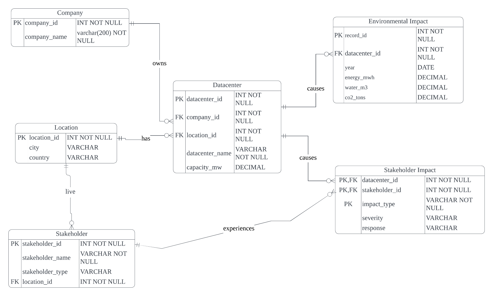
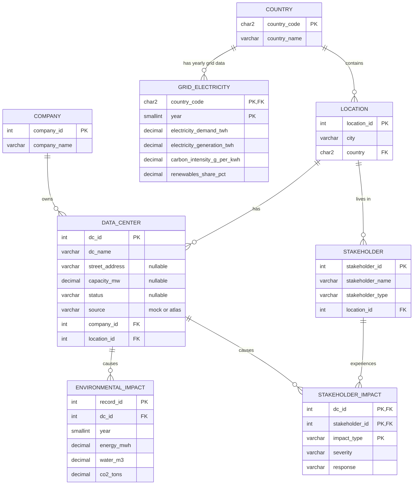

# Week 2 – ERD and normalisation report

The original submission (with all tables for Versions 1–4) is in [`week2_erd_normalization.pdf`](week2_erd_normalization.pdf). This page summarises it and adds **Version 5** (week 5): the normal-form violations we found when we loaded real-world data.

## ERD

### Week 2 ERD (LucidChart)

### Updated ERD (week 5)

Changes: new `COUNTRY` and `GRID_ELECTRICITY` entities; `LOCATION.country` is now an FK; `DATA_CENTER` gained `street_address` and `source`, with `capacity_mw` and `status` now optional; `year` is `SMALLINT` (the week 2 diagram said `DATE`, which did not match the schema).

## Versions 1–4 (week 2, summary)

| Version | Problem | Fix |
|---|---|---|
| 1 – not normalised | One `DataCenter` table. `stakeholder_names` and `impact_types` held lists; energy/water were repeated as columns per year (`year_2023_energy_mwh`, …) | – |
| 2 – 1NF | Lists in one cell and repeating year columns | One row per data centre + year + stakeholder + impact type. PK `(dc_id, year, stakeholder_id, impact_type)` |
| 3 – 2NF | Columns that depended on only part of the key (e.g. `company_name` only on `dc_id`, `stakeholder_name` only on `stakeholder_id`) | Split into `DataCenter`, `EnvironmentalImpact`, `Stakeholder`, `StakeholderImpact` (the bridge table for the M:N relationship) |
| 4 – 3NF | `company_name` depended on the company, not the site; city/country were repeated | `Company` and `Location` tables, referenced by FK |

## Version 5 – violations found in real-world data (week 5)

The two raw datasets had the same kinds of problems we fixed on paper in week 2. Full details are in [`../week5_real_world_data.md`](../week5_real_world_data.md), section 5.

| Normal form | Where | Violation | Fix |
|---|---|---|---|
| 1NF | Dataset A (ATLAS) | `address` holds street, postcode, city and country in one cell, e.g. `Kloosterweg 1, 6412 CN Heerlen, The Netherlands` | Split into `data_center.street_address` and `location` |
| 2NF | Dataset B (OWID) | Key is `(iso_code, year)`, but the country name depends only on `iso_code` (`Netherlands` stored 26 times) | New `country` table. `grid_electricity` only stores `country_code` |
| 3NF | Dataset A | `company` repeated on every row (Alticom 24×); transitive `site → city → country` | Same as Version 4: `company` and `location` (+ new `country`) tables |
| 3NF (avoided) | Our own design | Storing a postcode next to `location_id` would create `dc_id → postcode → city` | Postcode deliberately not stored |

**Result.** After loading, all 8 tables are in 3NF (see the checks in `checks.sql`). The real data is inserted through a flat staging table, but only the normalised tables are kept.
